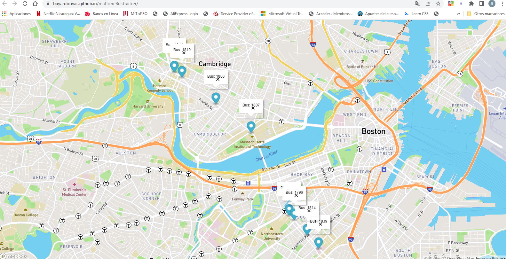

<div align="center" id="top"> 
  

  &#xa0;

  <!-- <a href="https://realtimebustracker.netlify.app">Splash</a> -->
</div>

<h1 align="center">Real Time Bus Tracker</h1>

<p align="center">
  

  

  

  

  <!--  -->

  <!--  -->

  <!--  -->
</p>

<!-- Status -->

<!-- <h4 align="center"> 
	🚧  Real Time Bus Tracker 🚀 Under construction...  🚧
</h4> 

<hr> -->

<p align="center">
  <a href="#dart-about">About</a> &#xa0; | &#xa0; 
  <a href="#sparkles-features">Features</a> &#xa0; | &#xa0;
  <a href="#rocket-technologies">Technologies</a> &#xa0; | &#xa0;
  <a href="#white_check_mark-requirements">Requirements</a> &#xa0; | &#xa0;
  <a href="#checkered_flag-starting">Starting</a> &#xa0; | &#xa0;
  <a href="#memo-license">License</a> &#xa0; | &#xa0;
  <a href="#recycle-improvements">Improvements</a> &#xa0; | &#xa0;	
  <a href="https://github.com/bayardorivas" target="_blank">Author</a>
</p>

<br>

## :dart: About ##

This project uses the "Mapbox Gl JS" library for vector maps on the web. In the project is added a marker at the map that trace all the bus stops you can find going from MIT Campus to Harvard Campus. I used some styles of the mapbox library and with an array of coordinates is traced the route. The project was created for the "Profesional Certificate in Coding: Fullstack Development with MERN - The Massachusetts Institute of Thechnology (MIT)". 

## :sparkles: Features ##

:heavy_check_mark: Map loading on web page\
:heavy_check_mark: Map marker defined\
:heavy_check_mark: Map marker animated using coordinates (longitude and latitude)

## :rocket: Technologies ##

The following tools were used in this project:

- Javascript
- HTML
- CSS
- Mapbox GL JS library  (https://www.mapbox.com/)

## :white_check_mark: Requirements ##

Before starting : you need to have [Git](https://git-scm.com) and [Node](https://nodejs.org/en/) installed to clone de the project.
It is must that you get a Mapbox account and create a token (key) and assign it to variable "mapboxgl.accessToken" in "mapanimation.js" file.

## :checkered_flag: Starting ##

```bash
# Clone this project
$ git clone https://github.com/bayardorivas/real-time-bus-tracker

# Access
$ cd real-time-bus-tracker

# Open the index.html file on your browser

# Click the "Show stops between MIT and Harvard" button to start the animation

# Click the "Reset" button to move the marker to start position.
```

## :recycle: Improvements ##

It would be nice the next improvements:
1. Change the marker Icon to a Bus image.
2. Try to change the marker to an animated image moving and through the way and not jumping between bus stops
3. Add reference text or names on every bus stop.

## :memo: License ##

This project is under license from MIT. For more details, see the [LICENSE](LICENSE.md) file.


Made with :heart: by <a href="https://github.com/bayardorivas" target="_blank">Bayardo Rivas</a>

&#xa0;

<a href="#top">Back to top</a>
